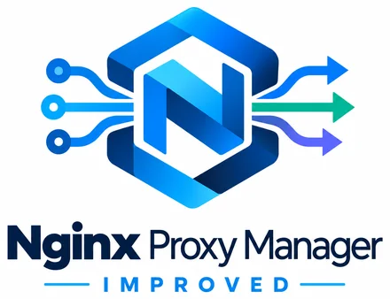

<p align="center">
  
</p>

<h1 align="center">NPM Improved</h1>

<p align="center">
  <strong>Reverse proxy management built for real-world reliability.</strong><br>
  Publish your self-hosted apps, manage HTTPS, add failover, recover from bad changes, and keep multiple proxy servers in sync from one friendly control center.
</p>

<p align="center">
  <a href="https://www.gigabytegrove.com/projects">Project page</a>
  ·
  <a href="https://github.com/gigabytegrove/npm-improved">GitHub</a>
  ·
  <a href="docs/src/guide/index.md">Documentation</a>
  ·
  <a href="ROADMAP.md">Roadmap</a>
  ·
  <a href="SECURITY.md">Security</a>
</p>

---

> **Current release**
>
> NPM Improved **v1.2.2** refines the Control Center with deep-linkable Settings sections, responsive navigation, clearer Default Site controls, copyable template variables, and formatted Update release notes. The `develop` branch remains the active integration branch.

## What is NPM Improved?

NPM Improved is a modernized fork of [Nginx Proxy Manager](https://github.com/NginxProxyManager/nginx-proxy-manager).

If you already know Nginx Proxy Manager, the basic idea is familiar: you point a domain name at an app or service, choose where the traffic should go, enable HTTPS, and manage it from a web interface.

NPM Improved keeps that simple workflow, but adds the things that become important when your reverse proxy is no longer "just a test box":

- safer configuration changes;
- automatic rollback when a change breaks Nginx;
- high availability for backend applications;
- synchronization between multiple NPM Improved servers;
- SQLite ↔ MySQL/MariaDB migration from the UI;
- shared MySQL mode for multiple NPM Improved nodes;
- encrypted backup and disaster recovery;
- configuration history;
- a recovery console that can stay available when the normal app is unhealthy;
- certificate lifecycle management;
- system-health monitoring;
- logs and security-event visibility;
- built-in HTTP protection controls;
- a native **Settings → Update** manager with health-verified updates and rollback;
- a redesigned management interface intended for day-to-day operations.

You do **not** need to understand raw Nginx configuration files to use these features.

## A few terms in plain English

If you are new to reverse proxies, these are the main terms you will see:

| Term | What it means |
| --- | --- |
| **Proxy Host** | A public or internal hostname such as `photos.example.com` that NPM Improved sends to one or more apps behind it. |
| **Backend / Upstream** | The actual server running your app, such as `192.168.1.50:8080`. |
| **Reverse Proxy** | The server that receives the user's web request first, handles things like HTTPS, then passes the request to the correct app. |
| **Certificate** | The TLS/SSL certificate that gives a site HTTPS. |
| **Control Center** | The NPM Improved web interface where you manage hosts, certificates, users, logs, backups, and health. |
| **Failover** | Automatically using another server when the preferred server is unavailable. |
| **Synchronization** | Keeping two or more NPM Improved servers on the same configuration. |

## What can NPM Improved do?

### Publish self-hosted apps without writing Nginx by hand

Create a Proxy Host, enter a domain, choose the backend server and port, and NPM Improved generates the Nginx configuration for you.

Typical examples include:

- Home Assistant;
- Jellyfin or Plex web interfaces;
- Immich;
- Nextcloud;
- Docker-hosted web apps;
- internal dashboards;
- web admin panels;
- development services;
- APIs;
- business applications.

NPM Improved also supports redirects, 404 hosts, TCP/UDP streams, access lists, custom locations, WebSockets, certificates, and advanced Nginx options.

### Use more than one backend for the same hostname

A normal reverse-proxy rule often points to one server:

```text
app.example.com
        ↓
192.168.1.50:8080
```

NPM Improved can point the same hostname at a pool of servers instead:

```text
                     ┌─ App Server 1
app.example.com ─────┼─ App Server 2
                     └─ App Server 3
```

That lets you build redundancy directly into the Proxy Host.

Available modes include:

- **Round robin** — spread requests across available servers.
- **Least connections** — prefer the server currently handling the fewest active connections.
- **Client IP affinity** — try to keep the same client on the same backend.
- **Primary + failover** — use one preferred server and automatically fall back to backup servers.

Each backend can have its own hostname/IP, port, weight, failure limit, failure timeout, label, and enabled state.

Nginx can retry another available backend when it encounters connection errors, timeouts, invalid upstream responses, or common server-error responses.

[Read the Proxy Host high-availability guide](docs/src/guide/high-availability.md).

## High availability at two different levels

NPM Improved supports two separate kinds of redundancy because they solve different problems.

### 1. Backend high availability

This protects you when the **application server** fails.

For example:

```text
Internet
   ↓
NPM Improved
   ↓
┌──────────────┬──────────────┬──────────────┐
App Server 1   App Server 2   App Server 3
```

If one app server is unavailable, Nginx can use another member of the upstream pool.

### 2. NPM Improved server high availability

This protects you when the **reverse proxy server itself** fails.

For example:

```text
                   ┌─ NPMi Primary ───────┐
Users / DNS / LB ──┤                      ├─ Your apps
                   └─ NPMi Secondary ─────┘
```

NPM Improved can synchronize two or more installations using a **Primary / Secondary** model over **NPMX (NPM Improved Exchange)**.

The Primary is the server where configuration changes are made. Adding a Secondary does not require inventing or manually copying a cluster secret: the Primary generates a short-lived one-time NPMX pairing code, the nodes negotiate capabilities, and persistent credentials are exchanged through an authenticated ephemeral key exchange.

Secondary servers then pull encrypted configuration snapshots and keep their own Nginx service ready to handle traffic. Snapshots include settings, certificates, certificate files, custom Nginx assets, and Default Site templates. Node-specific Default Site values are rendered locally after synchronization so a page can identify the exact proxy node that answered it.

If the Primary is lost, a Secondary can be promoted.

This gives you multiple possible proxy entry points without allowing two independent servers to silently overwrite each other's configuration.

[Read the Instance Synchronization guide](docs/src/guide/instance-sync.md).

## Start with SQLite, move to MySQL when you need it

NPM Improved does not force you to choose your long-term database on day one.

A small installation can start with the default SQLite database. Later, **Settings → Database & Storage** can copy that installation into MySQL/MariaDB, verify the destination, switch the backend, and restart it automatically.

You can also move back from MySQL to SQLite.

If you run several NPM Improved proxy servers, **Shared MySQL mode** lets them use one common database. NPM Improved coordinates login signing identity, shows the connected database nodes, and has every node watch the shared database so its local Nginx configuration follows changes made on another node.

Certificate files are still files, so multi-server deployments must also share or replicate `/etc/letsencrypt` and `/data/custom_ssl`.

[Read the Database & Shared MySQL guide](docs/src/guide/database.md).

## Cluster-aware Default Site templates

The **Settings → Default Site** custom HTML and redirect fields support template variables. That makes unmatched-host pages useful for troubleshooting, especially when several NPM Improved nodes sit behind DNS or a load balancer.

Examples include:

```text
{{node.hostname}}
{{node.name}}
{{node.id}}
{{node.role}}
{{node.public_url}}
{{node.version}}
{{node.build_commit}}
{{cluster.protocol}}
{{cluster.protocol_version}}
{{system.platform}}
{{system.arch}}
{{system.generated_at}}
```

NPMX synchronizes the template itself and each node renders its own local values. A single template can therefore say exactly which cluster member served the request instead of copying the Primary's already-rendered page to every Secondary.

## Safer configuration changes

A reverse proxy is often the front door to many applications. A single bad configuration should not take everything down.

NPM Improved treats important Nginx changes like a transaction:

```text
Create the new configuration
          ↓
Test it with nginx -t
          ↓
Activate it
          ↓
Reload Nginx
          ↓
Keep the change only if it worked
```

If validation or reload fails, NPM Improved restores the previous working configuration instead of leaving the server in a broken state.

For Proxy Hosts, Redirection Hosts, 404 Hosts, Streams, and related settings, the matching database change is also rolled back when the Nginx change cannot safely go live.

## Configuration History

NPM Improved keeps a history of configuration revisions.

That means you can see more than just "what the host looks like now." You can also inspect previous states and failed attempts.

Revisions can be:

- **Pending** — waiting to finish activation;
- **Active** — currently in use;
- **Superseded** — an older working configuration;
- **Failed** — a candidate that did not activate successfully.

Known-good older revisions can be restored through the same safe validation process.

Failed configurations are kept for troubleshooting, but they are not treated as safe restore points.

[Read about Configuration History](docs/src/guide/config-history.md).

## The management interface can survive traffic problems

Traditional reverse-proxy designs can make the management interface depend on the same traffic process you are trying to repair.

NPM Improved separates the management listener from the normal Nginx traffic process.

The Control Center on port `81` is served by an independent control-plane service. This means a broken Proxy Host or an unhealthy Nginx data plane does not automatically have to make the management interface disappear too.

The independent health endpoint is:

```text
/__npm_improved/health
```

The UI can use that independent status source to show what is still healthy when the normal backend is unavailable.

## System Health

The **System Health** workspace gives administrators a single place to see whether the important pieces of NPM Improved are working.

It includes visibility into:

- the independent management control plane;
- Nginx process state;
- Nginx configuration validity;
- the last successful Nginx reload;
- database connectivity and query latency;
- certificate renewal and lifecycle services;
- log storage;
- Configuration History processing.

The goal is to answer "what is actually broken?" instead of only returning a generic error page.

## Backup & disaster recovery

NPM Improved uses encrypted `.npmibak` backup files.

There are two backup styles.

### Configuration backup

Use this when you want to move or restore the configuration without replacing the destination server's local user identity.

It includes items such as:

- Proxy Hosts;
- Redirection Hosts;
- 404 Hosts;
- Streams;
- Access Lists;
- application settings;
- Configuration History;
- certificate records and certificate files;
- Let's Encrypt state;
- custom Nginx configuration;
- custom Default Site files.

### Full disaster recovery backup

Use this when you want to rebuild the **same NPM Improved installation** after server, disk, or container loss.

It includes the configuration backup contents plus items such as:

- users;
- permissions;
- authentication and two-factor state;
- JWT identity;
- recovery credentials;
- cluster secret;
- audit history.

Backups are encrypted using **AES-256-GCM** and require a passphrase.

Before restore, NPM Improved can inspect a backup and show what it contains without changing the current installation.

When a restore is actually performed, NPM Improved takes a rollback snapshot first, rebuilds the Nginx configuration, validates it, and returns to the old state if the restored configuration cannot safely start.

[Read the Backup & Disaster Recovery guide](docs/src/guide/disaster-recovery.md).

## Emergency recovery console

NPM Improved includes a separate recovery console at:

```text
http://<npm-improved-host>:81/recovery/
```

It is designed for the situation where the normal management application is unhealthy but the independent control plane is still available.

The recovery console can help with tasks such as:

- checking control-plane, backend, Nginx, and storage health;
- running `nginx -t`;
- performing a validated Nginx reload;
- reviewing failed configuration candidates;
- downloading retained encrypted backups;
- restoring a full disaster-recovery backup when the normal API is unavailable.

It uses its own recovery credential rather than the normal application login.

[Read the Recovery Console guide](docs/src/guide/recovery-console.md).

## HTTPS and certificate lifecycle

NPM Improved keeps the familiar certificate workflow while adding more visibility around certificate ownership and cleanup.

It can track where certificates are being used across supported host types.

Unused certificates can enter a configurable quarantine period before cleanup instead of disappearing immediately, and certificates that are still referenced by a host are protected from being removed underneath that host.

This makes certificate maintenance safer on systems that change frequently.

## Logs and security visibility

NPM Improved brings important logs into the web interface so you do not have to start with shell access every time something goes wrong.

The UI includes access to:

- system logs;
- Let's Encrypt logs;
- access logs;
- error logs;
- structured HTTP security events.

Security-event classification can highlight request patterns commonly associated with things such as:

- attempts to access `.env` or sensitive files;
- path traversal;
- SQL-injection-shaped requests;
- XSS-shaped requests;
- exploit endpoint probes;
- CMS/admin scans;
- web-shell filename probes;
- rate-limit enforcement.

These are **request-pattern classifications**, not claims that NPM Improved knows a visitor's intent.

## Built-in HTTP protection

NPM Improved includes managed HTTP protection profiles so common rate and connection controls can be enabled without hand-writing Nginx directives.

Available choices include:

- **Off**
- **Standard**
- **Aggressive**
- **Inherit the global setting**

The profiles can limit excessive requests and concurrent connections and can reduce resource use from slow clients.

Trusted IP addresses or networks can be excluded from those counters.

This protection is useful against application-layer abuse that reaches Nginx. It is **not** a replacement for upstream DDoS protection when an attack is large enough to saturate your Internet connection before Nginx ever sees the traffic.

[Read the HTTP Protection guide](docs/src/guide/protection.md).

## Quick start with Docker

### Requirements

You need:

- Docker Engine 24 or newer;
- Docker Compose v2;
- Git;
- available host ports for the services you want to expose.

### SQLite quick start

For the simplest single-server setup:

```bash
git clone https://github.com/gigabytegrove/npm-improved.git
cd npm-improved
./scripts/install-docker sqlite
```

The installer:

1. creates `.env` when needed;
2. checks Docker and Compose;
3. validates the Compose configuration;
4. checks whether the configured host ports are available;
5. builds NPM Improved from the checked-out source;
6. starts the stack;
7. waits for the application health check.

When startup finishes, open:

```text
http://<your-server>:81
```

and continue through the NPM Improved setup/login experience.

### If ports 80, 81, or 443 are already being used

NPM Improved checks before building and will not stop another service automatically.

To let the installer find and save free host-side ports:

```bash
./scripts/install-docker sqlite --auto-ports
```

### MySQL / MariaDB

```bash
cp .env.example .env
# Set MYSQL_PASSWORD and MYSQL_ROOT_PASSWORD in .env
./scripts/install-docker mysql
```

### PostgreSQL

```bash
cp .env.example .env
# Set the PostgreSQL values required by the compose file
./scripts/install-docker postgres
```

For storage paths, environment variables, database configuration, port mapping, backups, health checks, and update behavior, see [DOCKER.md](DOCKER.md).

## Default ports

The normal container-side ports are:

| Port | Used for |
| ---: | --- |
| **80** | HTTP web traffic |
| **81** | NPM Improved Control Center |
| **443** | HTTPS web traffic |

The host-side ports can be changed in `.env` when needed.

## Persistent data

The important persistent locations are:

```text
/data
/etc/letsencrypt
```

Keep both locations on persistent storage.

Even though NPM Improved includes application-level backups, infrastructure-level backups or snapshots of these locations are still recommended.

## Updating

Beginning with v1.1.0, normal single-node Docker installations can use **Settings → Update**.

The Update workspace shows the installed and latest stable versions, release notes, update progress, restart controls, and the previous image when rollback is available. Update/restart/rollback actions require the current administrator password.

NPM Improved uses a temporary, self-cleaning Docker handoff only while replacing the running application container. There is no permanent updater worker.

The move from v1.0.0 to v1.1.0 is the final normal CLI upgrade because v1.0.0 does not yet contain the Update manager. A typical SQLite upgrade is:

```bash
cd ~/npm-improved
git checkout develop
git pull --ff-only
./scripts/install-docker sqlite
```

Shared MySQL and Instance Synchronization deployments are intentionally excluded from single-node automatic updates. Upgrade those nodes together during a coordinated maintenance window.

For every upgrade:

- keep a current backup;
- review release notes;
- verify Proxy Hosts, certificates, streams, logs, health, and database state afterward.

## Compatibility with Nginx Proxy Manager

NPM Improved is based on Nginx Proxy Manager and intentionally keeps familiar concepts and workflows where practical.

Existing users should recognize:

- Proxy Hosts;
- Redirection Hosts;
- 404 Hosts;
- Streams;
- Access Lists;
- certificates;
- users;
- the general reverse-proxy workflow.

At the same time, NPM Improved adds its own generated configuration, database fields, management services, recovery features, high-availability behavior, synchronization, and UI.

Because of those differences, do not assume that a database or state written by NPM Improved can always be safely downgraded back to an older upstream Nginx Proxy Manager installation.

Back up first and test migrations deliberately.

## What NPM Improved does not try to be

NPM Improved is intentionally focused on reverse-proxy management.

It does not try to replace:

- your DNS provider;
- your router or firewall;
- your ISP;
- a CDN;
- upstream volumetric DDoS mitigation;
- a full distributed database cluster;
- a load balancer or virtual-IP system used to place multiple NPM Improved nodes behind one address.

For multi-node deployments, NPM Improved keeps the proxy configuration synchronized. Your DNS, load balancer, or virtual-IP layer decides how clients reach those nodes.

## Project status and releases

NPM Improved is on the stable **1.x** version line. **v1.1.0** adds native Control Center updates and official stable container images.

The active integration branch is:

```text
develop
```

A pre-built NPM Improved container image is not published yet. The supported deployment workflow is to build from this repository using the included Docker installer/Compose files.

Do **not** use the upstream `jc21/nginx-proxy-manager` image when testing NPM Improved features. That image is the upstream project and does not contain NPM Improved changes.

## Documentation

Start with the [NPM Improved Guide](docs/src/guide/index.md).

Useful guides include:

- [Docker installation](DOCKER.md)
- [Proxy Host high availability](docs/src/guide/high-availability.md)
- [Instance Synchronization](docs/src/guide/instance-sync.md)
- [Database & Shared MySQL](docs/src/guide/database.md)
- [Backup & Disaster Recovery](docs/src/guide/disaster-recovery.md)
- [Native Recovery Console](docs/src/guide/recovery-console.md)
- [Configuration History](docs/src/guide/config-history.md)
- [HTTP Protection](docs/src/guide/protection.md)

Project page:

**https://www.gigabytegrove.com/projects**

## Security

Please do **not** open a public GitHub issue for a security vulnerability.

Use the private reporting instructions in [SECURITY.md](SECURITY.md).

## Contributing

NPM Improved uses `develop` as its active integration branch.

Changes should be submitted through pull requests and must pass the repository's required checks before they are merged.

If you are changing behavior, include or update the matching documentation so users do not have to discover the feature from source code.

## Upstream project and license

NPM Improved is based on [Nginx Proxy Manager](https://github.com/NginxProxyManager/nginx-proxy-manager) and would not exist without the work of its maintainers and contributors.

The upstream project is licensed under the MIT License, and NPM Improved retains the applicable upstream attribution and MIT licensing in this repository.

---

<p align="center">
  <strong>NPM Improved</strong><br>
  A Gigabyte Grove project · <a href="https://www.gigabytegrove.com/projects">gigabytegrove.com/projects</a>
</p>
